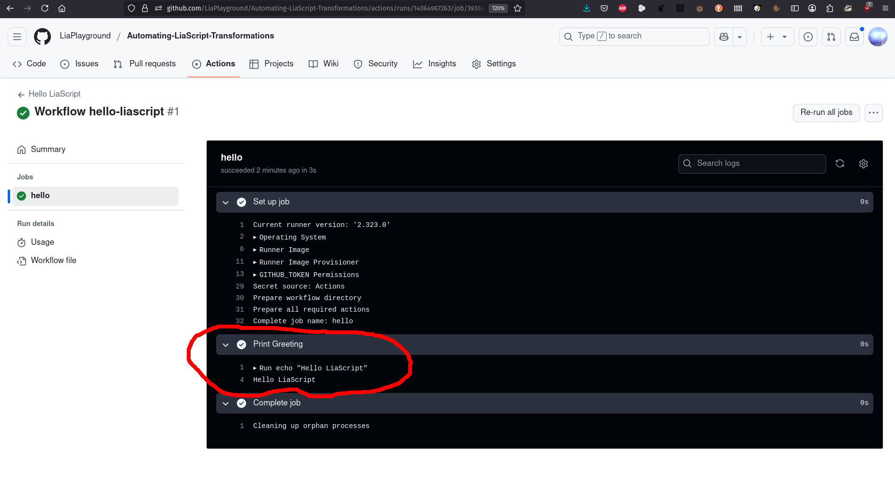

---

title: "Automating LiaScript Transformations on GitHub with Enhanced Workflows and Asset Generation"  
slug: automating-liascript-transformations-on-github  
date: 2025-03-24  
draft: false  
author: André Dietrich  
image: "/images/post/automation-1.jpg"

categories:
  - Community
  - Technology
  - Tools

tags:
  - GitHub
  - Automation
  - LiaScript
  - PDF
  - SCORM
  - IMS
  - Workflow

---

In today’s fast-paced development and educational environments, automation isn’t just a convenience—it’s essential. Automating the transformation of your LiaScript markdown documents into formats like PDF, SCORM, and IMS packages can streamline your workflow and reduce manual effort. In this post, we’ll walk you through setting up GitHub Workflows step by step—even if you’re just getting started with GitHub. Expect clear explanations, practical code examples, and TODOs where you can later add screenshots to visually support each step.

---

## What Are GitHub Workflows?

GitHub Workflows are the backbone of GitHub Actions. They let you automate common tasks—such as building, testing, or deploying your code—using simple YAML files stored in your repository (typically in the `.github/workflows` directory). Let’s break down the basics:

### Key Concepts

- **Triggers:**  
  Triggers define the event that starts the workflow. Examples include:
  - **Pushes:** Run the workflow whenever you push changes.
  - **Pull Requests:** Trigger when someone opens or updates a pull request.
  - **Scheduled Times:** Use cron syntax to run at set intervals.
  - **Manual Triggers:** Start workflows manually using `workflow_dispatch`.

- **Jobs:**  
  A job is a set of steps that runs in a virtual environment (like an Ubuntu machine). Jobs can run one after another or in parallel.

- **Steps:**  
  Each job consists of steps that run commands or use pre-built actions (like checking out your code).

- **Assets and Releases:**  
  Workflows can package outputs (such as PDFs, SCORM, or IMS packages) as release assets, making it easy to share the latest versions of your documentation or e-learning materials.

> **TODO:**  
> Add a screenshot showing the GitHub Actions page where you can see your workflows, including the current and previous runs.

---

## A Simple Example: "Hello LiaScript"

Let’s start with a basic YAML workflow that prints "Hello LiaScript" when you push changes. This example illustrates a single trigger, one job, and one step.

```yaml
# File: .github/workflows/hello-liascript.yml
name: Hello LiaScript

# Trigger: Run this workflow on every push.
on: push

jobs:
  hello:
    # Run on the latest Ubuntu runner.
    runs-on: ubuntu-latest

    steps:
      # Step 1: Print a greeting to the console.
      - name: Print Greeting
        run: echo "Hello LiaScript"
```



---

## Enhancing the Workflow: Installing Tools and Running the LiaScript Exporter

Now, let’s extend our simple workflow. This enhanced version installs Node.js and the LiaScript exporter, then converts your `README.md` into a PDF, SCORM package, and IMS package. Finally, it creates a GitHub release to store these assets.

### Extended Workflow Example

```yaml
# File: .github/workflows/generate-liascript-outputs.yml
name: Generate LiaScript Outputs

# Trigger: Run the workflow when changes are pushed to the 'main' branch.
on:
  push:
    branches:
      - main

jobs:
  generate:
    runs-on: ubuntu-latest

    steps:
      # Step 1: Check out the repository's code.
      - name: Checkout Repository
        uses: actions/checkout@v4

      # Step 2: Set up Node.js environment.
      - name: Set up Node.js
        uses: actions/setup-node@v3
        with:
          node-version: '16'  # Specify the Node.js version.

      # Step 3: Install the LiaScript exporter globally using npm.
      - name: Install LiaScript Exporter
        run: |
          npm install -g @liascript/exporter

      # Step 4: Generate a PDF from README.md.
      - name: Generate PDF
        run: |
          liaex -i README.md --format pdf --output Documentation --pdf-timeout 1500000

      # Step 5: Generate a SCORM package.
      - name: Generate SCORM
        run: |
          liaex -i README.md --format scorm --output SCORM

      # Step 6: Generate an IMS package.
      - name: Generate IMS Package
        run: |
          liaex -i README.md --format ims --output IMS

      # Step 7: Create a new GitHub release for the generated assets.
      - name: Create New Release
        id: create_release
        uses: actions/create-release@v1
        env:
          GITHUB_TOKEN: ${{ secrets.GITHUB_TOKEN }}
        with:
          tag_name: 'latest'
          release_name: 'Latest LiaScript Documentation'
          draft: false
          prerelease: false

      # Step 8: Upload the generated PDF as a release asset.
      - name: Upload PDF as Release Asset
        uses: actions/upload-release-asset@v1
        env:
          GITHUB_TOKEN: ${{ secrets.GITHUB_TOKEN }}
        with:
          upload_url: ${{ steps.create_release.outputs.upload_url }}
          asset_path: ./Documentation/Documentation.pdf
          asset_name: Documentation.pdf
          asset_content_type: application/pdf

      # Step 9: Upload the generated SCORM package.
      - name: Upload SCORM as Release Asset
        uses: actions/upload-release-asset@v1
        env:
          GITHUB_TOKEN: ${{ secrets.GITHUB_TOKEN }}
        with:
          upload_url: ${{ steps.create_release.outputs.upload_url }}
          asset_path: ./SCORM/scorm.zip
          asset_name: scorm.zip
          asset_content_type: application/zip

      # Step 10: Upload the generated IMS package.
      - name: Upload IMS as Release Asset
        uses: actions/upload-release-asset@v1
        env:
          GITHUB_TOKEN: ${{ secrets.GITHUB_TOKEN }}
        with:
          upload_url: ${{ steps.create_release.outputs.upload_url }}
          asset_path: ./IMS/ims.zip
          asset_name: ims.zip
          asset_content_type: application/zip
```

### Detailed Breakdown

1. **Repository Checkout and Environment Setup:**  
   - **Checkout:** Uses the official GitHub action to pull your repository’s code.  
   - **Node.js Setup:** Configures Node.js (version 16) to run npm commands and install global packages.

2. **Installing and Running the Exporter:**  
   - **Installation:** The LiaScript exporter is installed globally.  
   - **Conversion Steps:**  
     - **PDF:** Converts `README.md` to a PDF.  
     - **SCORM & IMS:** Similarly, converts to SCORM and IMS packages.

3. **Release Management:**  
   - **Create Release:** Generates a new GitHub release that will hold your assets.  
   - **Asset Uploads:** Each generated file (PDF, SCORM, IMS) is uploaded as a release asset.

> **TODO:**  
> Run this enhanced workflow on your repository. Then, capture screenshots of:
> - The **Actions** tab showing the current and previous workflow runs.
> - The file structure where the generated assets (Documentation.pdf, scorm.zip, ims.zip) are stored.
> - The release page displaying the uploaded assets.

---

## Understanding Workflow Triggers and Structure

### Triggers

Workflows are activated by various events, such as:

- **Push:** Every time you push commits to your repository.
- **Pull Request:** When a pull request is created or updated.
- **Schedule:** Using cron syntax for regular runs.
- **Manual:** Triggered by the user with `workflow_dispatch`.

For example, to run a workflow on pushes and on a daily schedule:

```yaml
on:
  push:
    branches:
      - main
  schedule:
    - cron: '0 0 * * *'  # Runs every day at midnight UTC.
```

> **TODO:**  
> Add a screenshot showing the YAML file in your repository to highlight the triggers section.

### Jobs and Steps

- **Jobs:** Run in isolated environments (e.g., Ubuntu) and can execute sequentially or in parallel.
- **Steps:** Run sequentially within a job and can be simple shell commands, actions, or scripts.

Each step is designed to be clear and modular, so you can easily add, remove, or update parts of your workflow.

### Assets in a Release

When your workflow generates files (like PDFs or packages), you can upload them as part of a GitHub release. The `actions/upload-release-asset` action makes it easy to attach these files to a release, ensuring that users always have access to the latest generated assets.

> **TODO:**  
> Capture a screenshot of the release page where the assets are displayed after upload.

---

## Conclusion

By leveraging GitHub Workflows, you can automate the conversion of LiaScript markdown documents into multiple formats—be it PDFs, SCORM, or IMS packages—with a single YAML file. This step-by-step guide is designed for beginners and emphasizes clarity, modularity, and a hands-on approach. 

Start by running the simple example and gradually build up to the full workflow. Don’t forget to add screenshots along the way to document and share your progress. This visual guide not only helps you keep track of changes but also serves as a valuable reference for others new to GitHub automation.

Happy automating, and remember to revisit your setup regularly for improvements!

> **TODO:**  
> Once you’ve run through the steps, update this post with your screenshots and any additional tips from your experience.

---

Feel free to adjust the code examples and instructions as needed for your specific project. Happy blogging!